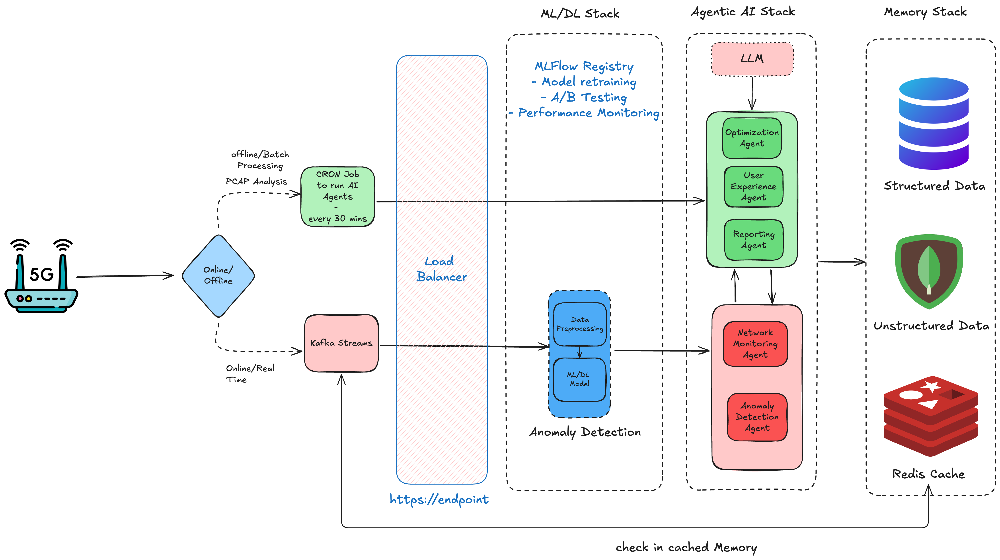

# 5G Modem Intelligence System - High Level Design

## System Goals and Objectives

The 5G Modem Intelligence System is designed to achieve the following core objectives:

1. **Proactive Performance Monitoring**: Continuously analyze 5G modem performance metrics to detect issues before they impact users
2. **Automated Anomaly Detection**: Identify abnormal patterns in network behavior using both ML and AI approaches
3. **Intelligent Root Cause Analysis**: Determine the underlying causes of performance issues
4. **Adaptive Optimization**: Suggest and implement parameter adjustments to improve modem performance
5. **User-Centric Insights**: Translate technical metrics into user experience impact assessment
6. **Self-Healing Capabilities**: Enable modems to automatically recover from detected issues

## 1. Functional Requirements

### Data Collection and Processing
- Ingest telemetry data from 5G modems through both real-time and batch paths
- Process and analyze PCAP (packet capture) files for network traffic insights
- Extract critical performance metrics from raw network data
- Support both edge computing (on-device) and cloud processing pipelines

### Anomaly Detection and Diagnostics
- Detect statistical anomalies in performance metrics (latency, throughput, signal strength)
- Identify temporal patterns and sequence-based anomalies in network behavior
- Classify anomaly types and severity levels
- Diagnose root causes of detected issues using contextual analysis

### Optimization and Self-Healing
- Generate parameter tuning recommendations for modem firmware
- Create self-healing strategies that can be automatically implemented
- Support dynamic frequency selection and beamforming parameter adjustments
- Optimize protocol-specific parameters based on observed performance

### User Experience Enhancement
- Predict potential issues before they impact user experience
- Map technical metrics to specific user activities (streaming, gaming, calls)
- Learn from user behavior to personalize network optimizations
- Assess optimization impacts on different user personas and usage scenarios

### Reporting and Knowledge Management
- Generate comprehensive technical reports for modem performance
- Create executive summaries with actionable insights
- Produce visualizations that clearly communicate performance trends
- Maintain a knowledge base of common issues and effective solutions

## 2. Non-Functional Requirements

### Performance
- Real-time processing latency: <500ms from data receipt to anomaly detection
- Batch processing completion: <15 minutes for full PCAP analysis
- Support for 1000+ concurrent modem connections per server instance
- ML model inference time: <100ms per prediction

### Scalability
- Support for 10,000+ modems in a production environment
- Horizontal scaling capability for all system components
- Data growth handling: estimated 2TB per day across all modems

### Storage Estimates (5-Year Retention)
| Data Type | Daily Volume | 5-Year Total | Storage Type |
|-----------|--------------|--------------|--------------|
| Raw Telemetry | 500GB | 912.5TB | TimescaleDB/Cold Storage |
| PCAP Files | 1.5TB | 2,737.5TB | Object Storage (S3/MinIO) |
| Anomaly Records | 5GB | 9.1TB | MongoDB |
| Optimization Records | 2GB | 3.7TB | PostgreSQL |
| Reports & Visualizations | 10GB | 18.3TB | Object Storage |
| ML Model Artifacts | 1GB | 1.8TB | MLFlow Registry |
| **Total** | **2.02TB** | **3,683TB** | |

*Note: Actual storage requirements may vary based on compression ratios, retention policies, and sampling strategies.*

### Reliability
- System availability: 99.95% uptime (excluding planned maintenance)
- Data durability: 99.999999% (11 nines) for critical telemetry data
- Fault tolerance for component failures with no data loss
- Graceful degradation during partial system outages

### Security
- End-to-end encryption for all data in transit
- Role-based access control for all system components
- Compliance with telecommunications data protection regulations
- Regular security audits and vulnerability assessments

### Maintainability
- Containerized deployment with Kubernetes orchestration
- Comprehensive logging and monitoring with ELK stack
- Automated backups and disaster recovery procedures
- CI/CD pipeline for all system components

## 3. MLFlow Architecture

The system utilizes MLFlow for managing the ML lifecycle with the following architecture:

```
MLFlow Architecture
├── Model Registry
│   ├── Production Models
│   │   ├── Anomaly Detection Models
│   │   │   ├── Isolation Forest (point anomalies)
│   │   │   ├── LSTM (sequence anomalies)
│   │   │   └── Ensemble Model
│   │   ├── Root Cause Analysis Models
│   │   └── Optimization Recommendation Models
│   ├── Staging Models
│   └── Development Models
├── Experiment Tracking
│   ├── Model Performance Metrics
│   ├── Hyperparameter Tuning Results
│   └── Feature Importance Analysis
├── Model Serving
│   ├── Real-time Inference API
│   ├── Batch Prediction Service
│   └── Model Versioning
└── Artifact Storage
    ├── Model Binaries
    ├── Feature Engineering Pipelines
    └── Evaluation Results
```

### ML Model Lifecycle Management
1. **Development**: Data scientists develop models in notebooks/IDEs
2. **Tracking**: Experiments are logged to MLFlow with parameters and metrics
3. **Registration**: Promising models are registered to the Model Registry
4. **Staging**: Models are promoted to staging for A/B testing
5. **Production**: Validated models are deployed to production
6. **Monitoring**: Models are continuously evaluated for performance decay
7. **Retraining**: Automated retraining pipelines update models when needed

## 4. Crew Design and Responsibilities

| Crew Name | Primary Use Cases | Tools Used | Agents Involved | Data Sources |
|-----------|-------------------|------------|-----------------|--------------|
| **Network Monitoring Crew** | - Real-time metric collection<br>- Performance analysis<br>- Initial anomaly flagging | - PCAP Analyzer<br>- Metrics Extractor<br>- Time Series Analysis | - Network Monitoring Agent | - Kafka Telemetry Stream<br>- PCAP Files |
| **Anomaly Detection Crew** | - Anomaly classification<br>- Root cause diagnosis<br>- Impact assessment | - Anomaly Detector<br>- ML Models<br>- Diagnostic Analyzer | - Anomaly Detection Agent<br>- ML/DL Models | - Processed Metrics<br>- Historical Anomalies |
| **Optimization Crew** | - Parameter tuning<br>- Self-healing strategies<br>- Protocol optimization | - Parameter Tuning Tool<br>- Optimization Simulator<br>- LLM for strategy creation | - Optimization Agent | - Anomaly Diagnoses<br>- Performance Metrics<br>- Configuration Database |
| **User Experience Crew** | - UX impact analysis<br>- Personalized optimizations<br>- Predictive issue prevention | - User Pattern Analyzer<br>- Application Profiler<br>- Persona Mapper | - User Experience Agent | - User Behavior Data<br>- Application Requirements<br>- Network Conditions |
| **Reporting Crew** | - Technical report generation<br>- Executive summaries<br>- Visualization creation | - PDF Generator<br>- Data Visualization<br>- Natural Language Generator | - Reporting Agent | - All Analysis Results<br>- Historical Data<br>- Optimization Recommendations |

## 5. High-Level Architecture



The architecture follows a hybrid approach with both real-time and batch processing paths:

1. **Data Ingestion**: Dual-path ingestion via Kafka (real-time) and PCAP storage (batch)
2. **ML Pipeline**: Preprocessing, feature extraction, and model inference
3. **AI Agent Layer**: CrewAI-based agents for specialized analysis tasks
4. **Storage Layer**: Tiered storage with hot, warm, and cold data zones
5. **Feedback Loops**: Continuous improvement through model and system feedback

## 6. Performance Metrics and Validation

### System Performance Metrics
| Metric Category | Specific Metrics | Target Values | Validation Method |
|-----------------|------------------|---------------|-------------------|
| **Response Time** | - Anomaly detection latency<br>- End-to-end processing time<br>- API response time | - <500ms<br>- <2s<br>- <100ms | Load testing with simulated traffic |
| **Throughput** | - Events processed per second<br>- Batch jobs per hour<br>- Concurrent modem connections | - 5,000 events/sec<br>- 12 jobs/hour<br>- 1,000+ connections | Stress testing with production workloads |
| **Accuracy** | - Anomaly detection precision<br>- Anomaly detection recall<br>- Root cause identification accuracy | - >90%<br>- >85%<br>- >80% | Comparison with human expert analysis |
| **Resource Utilization** | - CPU usage<br>- Memory consumption<br>- Network bandwidth<br>- Storage I/O | - <70% avg<br>- <80% peak<br>- <60% capacity<br>- <70% IOPS | Continuous monitoring in production |

### Modem Performance Metrics
| Metric Category | Specific Metrics | Normal Ranges | Anomaly Thresholds |
|-----------------|------------------|---------------|---------------------|
| **Latency** | - Average latency (ms)<br>- Minimum latency (ms)<br>- Maximum latency (ms)<br>- Jitter (ms) | - 20-50ms<br>- 10-20ms<br>- 50-100ms<br>- 5-15ms | - >100ms<br>- >30ms<br>- >200ms<br>- >30ms |
| **Throughput** | - Average throughput (Mbps)<br>- Peak throughput (Mbps)<br>- Minimum throughput (Mbps) | - 100-500 Mbps<br>- 500-1000 Mbps<br>- 50-100 Mbps | - <50 Mbps<br>- <200 Mbps<br>- <10 Mbps |
| **Signal Strength** | - RSSI (dBm)<br>- SINR (dB)<br>- Reference Signal Power (dBm) | - -65 to -75 dBm<br>- 10-20 dB<br>- -80 to -90 dBm | - < -90 dBm<br>- < 5 dB<br>- < -100 dBm |
| **Packet Loss** | - Loss percentage (%)<br>- Retransmission rate (%)<br>- Packet error rate (%) | - 0.1-0.5%<br>- 0.5-2%<br>- 0.1-1% | - >2%<br>- >5%<br>- >3% |
| **Connection** | - Handshake time (ms)<br>- Connection success rate (%)<br>- Handover success rate (%) | - 50-150ms<br>- 98-100%<br>- 95-100% | - >300ms<br>- <95%<br>- <90% |

### Agent Performance Validation
Each AI agent is validated using the following approach:
1. **Ground Truth Comparison**: Agent outputs compared to human expert analysis
2. **A/B Testing**: New agent versions tested against current production versions
3. **User Feedback Loop**: Effectiveness rated by engineering teams
4. **Outcome Measurement**: Impact of agent recommendations on modem performance

## 7. Memory Schema Design

### Short-Term Memory (Redis Cache)
```json
{
  "modem_session": {
    "modem_id": "string",
    "session_start": "timestamp",
    "session_ttl": "integer (seconds)",
    "recent_metrics": [
      {
        "timestamp": "timestamp",
        "metric_type": "string",
        "value": "float",
        "is_anomaly": "boolean"
      }
    ],
    "active_anomalies": [
      {
        "anomaly_id": "string",
        "detected_at": "timestamp",
        "type": "string",
        "severity": "string",
        "status": "string"
      }
    ],
    "pending_optimizations": [
      {
        "optimization_id": "string",
        "parameter": "string",
        "current_value": "any",
        "recommended_value": "any",
        "priority": "integer"
      }
    ]
  }
}
```

### Long-Term Memory (Persistent Storage)
```json
{
  "modem_profile": {
    "modem_id": "string",
    "hardware_model": "string",
    "firmware_version": "string",
    "region": "string",
    "installation_date": "timestamp",
    "customer_type": "string"
  },
  "performance_history": {
    "modem_id": "string",
    "metrics": {
      "daily_summaries": [
        {
          "date": "date",
          "avg_latency_ms": "float",
          "avg_throughput_mbps": "float",
          "avg_signal_strength_dbm": "float",
          "packet_loss_pct": "float"
        }
      ],
      "monthly_trends": {
        "latency_trend": "float",
        "throughput_trend": "float",
        "signal_trend": "float"
      }
    }
  },
  "anomaly_history": {
    "modem_id": "string",
    "anomalies": [
      {
        "anomaly_id": "string",
        "timestamp": "timestamp",
        "type": "string",
        "root_cause": "string",
        "resolution": "string",
        "resolution_time_minutes": "integer"
      }
    ],
    "pattern_insights": {
      "common_issues": [
        {
          "issue_type": "string",
          "frequency": "integer",
          "avg_impact": "float"
        }
      ]
    }
  },
  "optimization_history": {
    "modem_id": "string",
    "optimizations": [
      {
        "optimization_id": "string",
        "timestamp": "timestamp",
        "parameter": "string",
        "old_value": "any",
        "new_value": "any",
        "performance_impact": "float"
      }
    ]
  }
}
```

## 8. Additional Design Considerations

### Deployment Architecture
- **Containerization**: All components deployed as Docker containers
- **Orchestration**: Kubernetes for container management
- **Service Mesh**: Istio for inter-service communication and security
- **Infrastructure**: Cloud-agnostic with support for AWS, Azure, and GCP

### Disaster Recovery
- **Backup Strategy**: Daily full backups, hourly incremental backups
- **Geo-Redundancy**: Multi-region deployment for critical components
- **Recovery Time Objective (RTO)**: <4 hours for full system recovery
- **Recovery Point Objective (RPO)**: <15 minutes data loss in worst case

### Privacy and Compliance
- **Data Anonymization**: Personal data is anonymized before processing
- **Retention Policies**: Automated enforcement of data retention rules
- **Audit Trails**: Comprehensive logging of all system accesses and changes
- **Regulatory Compliance**: Designed to meet telecom regulatory requirements

### CI/CD Pipeline
- **Source Control**: Git-based version control with feature branches
- **Build Automation**: Jenkins/GitHub Actions for automated builds
- **Testing**: Automated unit, integration, and regression testing
- **Deployment**: Blue-green deployment strategy for zero-downtime updates

### Future Expansion
- **6G Readiness**: Architecture designed to adapt to future network technologies
- **Edge AI**: Capability to push more intelligence to the edge (modem itself)
- **Federated Learning**: Framework for training models across distributed modems
- **Digital Twin**: Capability to simulate modem behavior for predictive optimization
