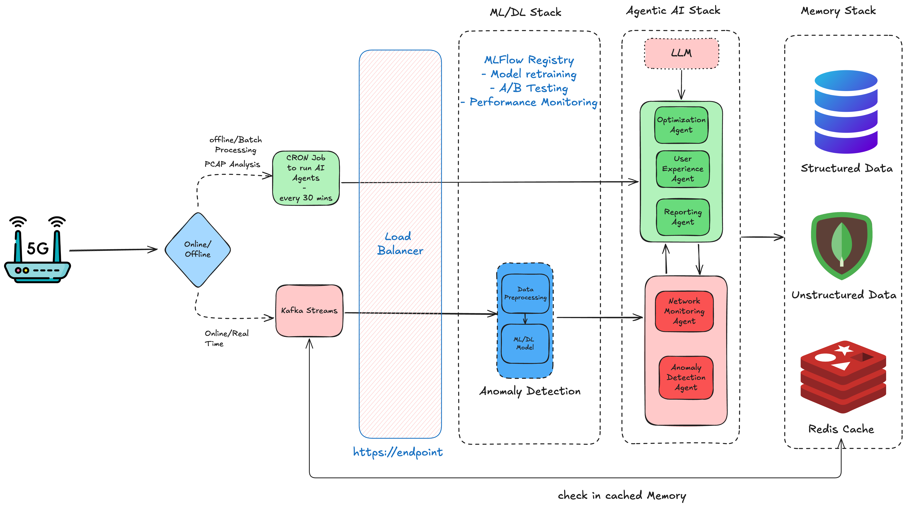

# 5G Modem Intelligence Crew

An AI-powered system for analyzing and optimizing 5G modem performance using CrewAI.


## Overview

This project uses a multi-agent system with CrewAI to analyze 5G modem performance, detect anomalies, optimize parameters, enhance user experience, and generate insightful reports. The system works with PCAP files to perform offline analysis of network performance.

## High Level Design - Check in HLD folder for more details


## Crew Design and Responsibilities

| Crew Name | Primary Use Cases | Tools Used | Agents Involved | Data Sources |
|-----------|-------------------|------------|-----------------|--------------|
| **Network Monitoring Crew** | - Real-time metric collection<br>- Performance analysis<br>- Initial anomaly flagging | - PCAP Analyzer<br>- Metrics Extractor<br>- Time Series Analysis | - Network Monitoring Agent | - Kafka Telemetry Stream<br>- PCAP Files |
| **Anomaly Detection Crew** | - Anomaly classification<br>- Root cause diagnosis<br>- Impact assessment | - Anomaly Detector<br>- ML Models<br>- Diagnostic Analyzer | - Anomaly Detection Agent<br>- ML/DL Models | - Processed Metrics<br>- Historical Anomalies |
| **Optimization Crew** | - Parameter tuning<br>- Self-healing strategies<br>- Protocol optimization | - Parameter Tuning Tool<br>- Optimization Simulator<br>- LLM for strategy creation | - Optimization Agent | - Anomaly Diagnoses<br>- Performance Metrics<br>- Configuration Database |
| **User Experience Crew** | - UX impact analysis<br>- Personalized optimizations<br>- Predictive issue prevention | - User Pattern Analyzer<br>- Application Profiler<br>- Persona Mapper | - User Experience Agent | - User Behavior Data<br>- Application Requirements<br>- Network Conditions |
| **Reporting Crew** | - Technical report generation<br>- Executive summaries<br>- Visualization creation | - PDF Generator<br>- Data Visualization<br>- Natural Language Generator | - Reporting Agent | - All Analysis Results<br>- Historical Data<br>- Optimization Recommendations |


## Terminal


## Sample PDF Output - Check in output/	folder


## Five Agents

The system consists of five specialized AI agents:

1. **Network Monitoring Agent**: Collects and processes real-time modem performance metrics.
2. **Anomaly Detection & Diagnosis Agent**: Identifies and diagnoses performance issues.
3. **Optimization & Self-Healing Agent**: Recommends corrective measures for detected issues.
4. **User Experience Enhancement Agent**: Focuses on preventing latency spikes and connection issues.
5. **Reporting & Insights Agent**: Generates comprehensive reports with actionable insights.

## Setup

1. Clone the repository:
   ```
   git clone https://github.com/bhanumahesh1993/5G-Agent-CrewAI.git
   cd 5G-Agent-CrewAI
   ```

2. Install dependencies:
   ```
   pip install -r requirements.txt
   ```

3. Create a `.env` file based on the template:
   ```
   cp .env.example .env
   ```

4. Update the `.env` file with your OpenAI API key and other configurations.

5. Place your PCAP file in the `data/` directory or update the `PCAP_FILE_PATH` in the `.env` file.

## Usage

Run the main script:

```
python3 run_analysis.py
```

The system will:
1. Load and analyze the PCAP file
2. Detect any network anomalies
3. Generate optimization recommendations
4. Create a comprehensive PDF report in the `output/` directory

## Customization

You can modify the configurations in the `.env` file to:
- Change the OpenAI model
- Adjust verbosity levels
- Change input/output paths

## Requirements

- Python 3.8+
- OpenAI API key
- PCAP file with 5G modem data
